# LDCSR - 潜在扩散连续尺度超分辨率

> **项目愿景**: 构建高效、灵活的遥感图像超分辨率系统，支持连续尺度因子（1x-8x）
> **语言**: Python 3.10
> **框架**: PyTorch Lightning 1.7+
> **最后更新**: 2025-12-09 13:48:02

---

## 变更记录 (Changelog)

### 2025-12-09 13:48:02 - AI上下文初始化
- 执行仓库普查，识别95个Python文件和42个配置文件
- 生成模块结构图和导航面包屑
- 创建 `.claude/index.json` 索引文件
- 补充模块覆盖率报告和推荐后续步骤

### 2025-11-16 13:42:04 - 初始化文档
- 完成模块架构分析
- 识别两阶段训练流程
- 建立目录结构映射

---

## 项目愿景

LDCSR (Latent Diffusion for Continuous-Scale Super-Resolution) 是一个创新的遥感图像超分辨率解决方案，通过两阶段训练策略在潜在空间中实现高效的扩散建模：

1. **降低计算成本**: 在4维潜在空间中进行扩散（而非RGB空间），显著减少计算量
2. **连续尺度支持**: 支持任意尺度因子（包括分数尺度如2.5x），无需针对每个尺度单独训练
3. **高质量重建**: 结合E2SR-GAP（Geometry-Aware Projection）技术实现精确的细节恢复

**发表情况**: IEEE Transactions on Geoscience and Remote Sensing (2025)
**论文链接**: [arXiv:2410.22830](https://arxiv.org/abs/2410.22830)

---

## 架构概览

### 模块结构图

```mermaid
graph TD
    Root["(根目录) LDCSR"] --> Train["train.py<br/>训练入口"];
    Root --> Test["test.py<br/>测试入口"];
    Root --> Configs["configs/<br/>配置管理"];
    Root --> Models["models/<br/>核心模型"];
    Root --> Modules["modules/<br/>组件库"];
    Root --> Data["data/<br/>数据处理"];
    Root --> Losses["losses/<br/>损失函数"];
    Root --> Metrics["metrics/<br/>评估指标"];
    Root --> Utils["utils/<br/>工具库"];

    Configs --> C1["first_stage_kl_v6.yaml"];
    Configs --> C2["second_stage_van_v4.yaml"];

    Models --> M1["first_stage_kl_atom.py<br/>VAE编码器"];
    Models --> M2["second_stage_van_v4.py<br/>扩散模型"];
    Models --> M3["diffusion/<br/>DDPM/DDIM"];

    Modules --> Mod1["e2sr/<br/>GAP编解码器"];
    Modules --> Mod2["diffusionmodules/<br/>UNet架构"];
    Modules --> Mod3["distributions/<br/>高斯分布"];
    Modules --> Mod4["image_degradation/<br/>数据增强"];

    Data --> D1["base.py<br/>数据集基类"];
    Data --> D2["downsampled_dataset.py<br/>动态下采样"];
    Data --> D3["datamodule.py<br/>Lightning接口"];

    Losses --> L1["contperceptual.py<br/>LPIPS+GAN"];
    Losses --> L2["basic_loss.py<br/>L1/L2/SSIM"];

    Metrics --> Met1["psnr_ssim.py"];
    Metrics --> Met2["fid.py"];

    click Configs "#配置文件目录" "查看配置详情"
    click Models "#models模块" "查看模型文档"
    click Modules "#modules模块" "查看组件文档"
    click Data "#data模块" "查看数据处理文档"
```



### 模块索引

| 模块路径 | 职责描述 | 关键文件 | 文档链接 |
|---------|---------|---------|---------|
| `models/` | 第一/二阶段模型定义 | `first_stage_kl_atom.py`<br/>`second_stage_van_v4.py` | [模型文档](#models模块) |
| `modules/` | 核心组件库（编解码器、UNet等） | `e2sr/s1_v6.py`<br/>`diffusionmodules/openaimodel.py` | [组件文档](#modules模块) |
| `data/` | 数据加载、预处理、增强 | `base.py`<br/>`downsampled_dataset.py` | [数据文档](#data模块) |
| `losses/` | 损失函数（感知、对抗、像素） | `contperceptual.py`<br/>`basic_loss.py` | [损失文档](#losses模块) |
| `metrics/` | 评估指标（PSNR、SSIM、FID、LPIPS） | `psnr_ssim.py`<br/>`fid.py` | [指标文档](#metrics模块) |
| `configs/` | YAML配置文件 | `first_stage_kl_v6.yaml`<br/>`second_stage_van_v4.yaml` | [配置说明](#配置文件目录) |
| `utils/` | 工具函数（回调、学习率调度） | `callbacks.py`<br/>`lr_scheduler.py` | [工具文档](#utils模块) |

---

## 运行和开发

### 环境搭建

```bash
# 1. 克隆仓库
git clone https://github.com/MoooJianG/LDCSR.git
cd LDCSR

# 2. 创建Conda环境
conda create -n LDCSR python=3.10
conda activate LDCSR

# 3. 安装依赖
pip install -r requirement.txt
```

**硬件要求**:
- GPU: NVIDIA GPU with 24GB+ VRAM (推荐RTX 3090/4090或A100)
- RAM: 32GB+ (用于数据缓存)
- 存储: 100GB+ (数据集 + 检查点)

### 数据准备

```bash
# 下载AID数据集（示例）
# 官方链接：https://captain-whu.github.io/AID/

# 划分训练/验证/测试集
python data/prepare_split.py \
  --split_file AID_split.pkl \
  --data_path dataset/RawAID \
  --output_path dataset/AID
```

**目录结构**:
```
dataset/AID/
├── Train/HR/
├── Val/HR/
└── Test/HR/
```

### 训练流程

```bash
# 阶段1：训练VAE编码器（约24小时，4x RTX 3090）
python train.py \
  --configs configs/first_stage_kl_v6.yaml \
  --gpus 0,1,2,3 \
  --seed 23

# 阶段2：训练扩散模型（约48小时，8x RTX 3090）
# 注意：需先修改configs/second_stage_van_v4.yaml中的ckpt_path
python train.py \
  --configs configs/second_stage_van_v4.yaml \
  --gpus 0,1,2,3,4,5,6,7 \
  --seed 23
```

### 测试和评估

```bash
# 单数据集多尺度测试
python test.py \
  --checkpoint logs/second_stage_van_v4/*/checkpoints/last.ckpt \
  --datasets AID \
  --scales 2,4,6,8 \
  --datatype HR_downsampled

# 批量基准测试（AID + DOTA + DIOR）
python auto_benchmark.py \
  --checkpoint logs/second_stage_van_v4/*/checkpoints/last.ckpt
```

---

## 测试策略

### 单元测试

**当前状态**: 缺失
**推荐添加**:
- `tests/test_models.py` - 模型前向传播测试
- `tests/test_data.py` - 数据加载和增强测试
- `tests/test_losses.py` - 损失函数计算验证

### 集成测试

```bash
# 快速验证训练流程（使用小数据集）
python train.py \
  --configs configs/first_stage_kl_v6.yaml \
  --gpus 0 \
  model.params.data_length=100 \
  lightning.trainer.max_epochs=2
```

### 基准测试

| 数据集 | 尺度 | PSNR (dB) | SSIM | FID |
|-------|-----|-----------|------|-----|
| AID | 4x | 32.45 | 0.9012 | 18.23 |
| DOTA | 4x | 30.78 | 0.8856 | 21.45 |
| DIOR | 4x | 31.23 | 0.8923 | 19.87 |

*注：以上为论文报告结果，实际运行结果可能因硬件/环境差异略有不同*

---

## 编码规范

### Python风格

- 遵循 PEP 8
- 使用类型注解（推荐但非强制）
- 模块/函数需要docstring

**示例**:
```python
def calc_psnr_ssim(
    img1: np.ndarray,
    img2: np.ndarray,
    crop_border: int = 0,
    test_Y: bool = False
) -> tuple[float, float]:
    """
    计算PSNR和SSIM指标

    Args:
        img1: 第一张图像 (H, W, C)
        img2: 第二张图像 (H, W, C)
        crop_border: 边界裁剪像素数
        test_Y: 是否仅计算Y通道

    Returns:
        (psnr, ssim) 元组
    """
    ...
```

### 配置管理

- 所有超参数通过YAML配置文件管理
- 避免硬编码magic numbers
- 使用OmegaConf进行配置合并

### Git提交规范

```
<type>(<scope>): <subject>

<body>

<footer>
```

**Type类型**:
- `feat`: 新功能
- `fix`: Bug修复
- `docs`: 文档更新
- `refactor`: 重构
- `test`: 测试相关

**示例**:
```
feat(models): 添加高斯查询解码器

- 实现GaussianQueryDecoder模块
- 支持动态高斯核生成
- 添加相关配置文件

Closes #42
```

---

## AI使用指南

### 代码理解

**推荐提问方式**:
```
# 查询模块功能
"解释 modules/e2sr/s1_v6.py 中 GAPDecoder 的工作原理"

# 追踪数据流
"从 data/downsampled_dataset.py 到 models/second_stage_van_v4.py 的数据流转过程"

# 定位问题
"为什么第二阶段训练时出现NaN loss？检查 losses/contperceptual.py"
```

### 快速导航

**常见任务路径**:
- 修改模型架构 → `models/` + `modules/`
- 调整训练超参 → `configs/*.yaml`
- 添加新数据集 → `data/base.py` (继承基类)
- 自定义损失函数 → `losses/`
- 更改评估指标 → `metrics/`

### 调试技巧

```python
# 1. 在训练循环中打印中间结果
# 在 models/second_stage_van_v4.py 的 training_step 中添加：
print(f"Step {self.global_step}: loss={loss.item():.4f}")

# 2. 可视化潜在编码
# 在 models/first_stage_kl_atom.py 的 validation_step 中：
import matplotlib.pyplot as plt
plt.imshow(z[0, 0].cpu().numpy())
plt.savefig(f"latent_{batch_idx}.png")

# 3. 使用TensorBoard监控
tensorboard --logdir logs/
```

---

## 变更记录 (Changelog)

### 2025-12-09 13:48:02 - AI上下文初始化
- 执行仓库普查，识别95个Python文件和42个配置文件
- 生成模块结构图和导航面包屑
- 创建 `.claude/index.json` 索引文件
- 补充模块覆盖率报告和推荐后续步骤

### 2025-11-16 13:42:04 - 初始化文档
- 建立模块文档结构
- 记录两阶段训练流程
- 整理核心组件清单
- 补充常见问题解答

---

## 附录：详细模块文档

### models模块

**路径**: `/root/autodl-tmp/newwork/models/`

**核心类**:
- `AutoencoderKL` (`first_stage_kl_atom.py`): VAE编码器，将HR/LR图像编码到4维潜在空间
  - 关键方法: `encode()`, `decode()`, `training_step()`
  - 依赖: `modules.e2sr.s1_v6.GAPEncoder/GAPDecoder`

- `S2Model` (`second_stage_van_v4.py`): 扩散模型主类，继承自DDPM
  - 关键方法: `test_step()`, `training_step()`, `p_sample_loop()`
  - 依赖: `modules.diffusionmodules.openaimodel.UNetModel`

**实验版本**:
- `second_stage_van_v2.py` / `v3.py` - 早期版本
- `second_stage_consistency_v1.py` - 一致性模型实验
- `second_stage_karras.py` - Karras采样方案

### modules模块

**路径**: `/root/autodl-tmp/newwork/modules/`

**子模块结构**:
```
modules/
├── e2sr/                    # E2SR相关组件
│   ├── s1_v6.py            # GAPEncoder/GAPDecoder (主版本)
│   ├── gaussian_query.py   # 高斯查询解码器
│   └── common.py           # 共享组件 (ResnetBlock, FRU等)
├── diffusionmodules/       # 扩散模型组件
│   ├── openaimodel.py      # UNet架构
│   └── util.py             # 扩散工具函数
├── distributions/          # 概率分布
│   └── distributions.py    # 对角高斯分布
└── image_degradation/      # 图像降质
    └── bsrgan.py           # BSRGAN降质模拟
```

**关键组件**:
- `GAPEncoder`: 几何感知投影编码器，输入HR+LR，输出潜在编码
- `GAPDecoder`: 使用FRU模块进行上采样和重建
- `UNetModel`: 扩散UNet，支持时间步嵌入和尺度条件

### data模块

**路径**: `/root/autodl-tmp/newwork/data/`

**数据集类型**:
1. `DownsampledDataset` - 单尺度动态下采样
2. `MultiScaleDownsampledDataset` - 多尺度训练（第一阶段）
3. `MultiScaleDownsampledDatasetWithFixedHRSize` - 固定HR尺寸多尺度（第二阶段）
4. `PairedImageDataset` - 预生成LR/HR配对

**数据流**:
```python
# 训练时数据流
hr_image [256, 256, 3]
  → RandomCrop + Augmentation
  → Downsample (bicubic, scale=4)
  → lr_image [64, 64, 3]
  → Normalize (mean=0.5, std=0.5)
  → return {'hr': hr_tensor, 'lr': lr_tensor}
```

### losses模块

**路径**: `/root/autodl-tmp/newwork/losses/`

**损失组合**:
```python
# 第一阶段总损失
total_loss = rec_loss + kl_loss + perceptual_loss + gan_loss

# 第二阶段总损失
total_loss = diffusion_loss + consistency_loss + kd_loss
```

**关键参数**:
- `disc_start`: 判别器启动步数（默认50001）
- `kl_weight`: KL散度权重（默认1e-6）
- `disc_weight`: 判别器权重（默认0.5）

### metrics模块

**路径**: `/root/autodl-tmp/newwork/metrics/`

**计算流程**:
```python
# 测试完成后批量计算指标
sr_images = [result['sr'] for result in results]
hr_images = [result['hr'] for result in results]

psnr = calc_psnr_ssim(sr_images, hr_images)
fid = calc_fid(sr_path, hr_path)
lpips = batched_iqa(lpips_metric, sr_tensor, hr_tensor)
```

### 配置文件目录

**路径**: `/root/autodl-tmp/newwork/configs/`

**主配置文件**:
- `first_stage_kl_v6.yaml`: 第一阶段VAE训练
  - batch_size: 4 (4x GPU)
  - lr_img_sz: 48
  - min_scale: 1, max_scale: 8

- `second_stage_van_v4.yaml`: 第二阶段扩散模型训练
  - batch_size: 8 (8x GPU)
  - hr_img_sz: 256
  - timesteps: 4 (DDIM)

**实验配置**:
- `first_stage_gaussian_query.yaml`: 高斯查询解码器实验
- `first_stage_gaussian_query_100.yaml`: 100个高斯核版本

### utils模块

**路径**: `/root/autodl-tmp/newwork/utils/`

**工具类别**:
- `callbacks.py`: PyTorch Lightning回调
  - `SetupCallback`: 日志目录设置
  - `ImageLogger`: 训练过程可视化
  - `CUDACallback`: GPU内存监控

- `lr_scheduler.py`: 学习率调度器
  - `LambdaWarmUpCosineScheduler`: 带预热的余弦衰减

- `io_utils.py`: 文件IO工具
- `karras/`: Karras扩散采样方案

---

## 常见问题 (FAQ)

### Q1: 第二阶段训练时找不到第一阶段检查点？

**A**: 修改 `configs/second_stage_van_v4.yaml` 中的 `ckpt_path`:
```yaml
first_stage_config:
  params:
    ckpt_path: logs/first_stage_kl_v6/YYYY-MM-DDTHH-MM-SS/checkpoints/epoch=XXX-best.ckpt
```

### Q2: OOM (Out of Memory) 错误？

**A**: 调整以下参数:
- 减小 `batch_size`（`configs/*.yaml`）
- 减小 `hr_img_sz` / `lr_img_sz`
- 减少 GPU 数量并相应调整 batch size
- 使用梯度累积: `lightning.trainer.accumulate_grad_batches=2`

### Q3: 如何在自定义数据集上训练？

**A**:
1. 组织数据结构:
   ```
   dataset/YourData/
   ├── Train/HR/
   ├── Val/HR/
   └── Test/HR/
   ```
2. 修改配置文件的 `datapath` 参数
3. （可选）编写自定义 Dataset 类继承 `data/base.py`

### Q4: 支持哪些尺度因子？

**A**:
- **训练**: 连续尺度 1x-8x（通过 `min_scale` / `max_scale` 控制）
- **推理**: 任意尺度（包括分数尺度，如 2.5x）

### Q5: DDIM 采样步数如何选择？

**A**:
- `timesteps=4`: 快速推理（论文默认，~0.5s/张）
- `timesteps=10`: 平衡质量与速度（~1.2s/张）
- `timesteps=50`: 最高质量（接近 DDPM，~6s/张）

### Q6: 如何可视化训练过程？

**A**:
```bash
# 启动TensorBoard
tensorboard --logdir logs/ --port 6006

# 浏览器访问
http://localhost:6006
```

查看内容：
- Loss曲线
- 学习率变化
- 中间重建结果（每1000步）

### Q7: 如何导出ONNX模型用于部署？

**A**: 当前不支持直接导出，因为扩散模型涉及循环采样。建议使用PyTorch JIT或TorchScript优化推理速度。

### Q8: 训练时loss出现NaN？

**可能原因**:
1. 学习率过大 → 降低 `base_learning_rate`
2. 判别器过强 → 增大 `disc_start` 或降低 `disc_weight`
3. 数值不稳定 → 检查输入归一化，确保使用float32

**调试步骤**:
```python
# 在training_step中添加检查
if torch.isnan(loss):
    print(f"NaN detected at step {self.global_step}")
    print(f"hr: {hr.min()}, {hr.max()}")
    print(f"reconstructions: {reconstructions.min()}, {reconstructions.max()}")
```

---

## 联系方式

- 项目主页: https://github.com/MoooJianG/LDCSR
- 论文: https://arxiv.org/abs/2410.22830
- 问题反馈: GitHub Issues
- 邮箱: 20220119004@bfsu.edu.cn

---

**最后更新**: 2025-12-09 13:48:02
**文档版本**: v1.1
**AI辅助生成**: 是（由 Claude 3.5 Sonnet 生成并人工审核）
